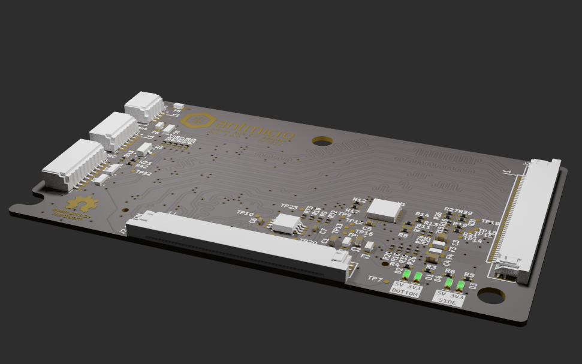

# Antmicro Jetson AGX CSI Adapter
Copyright (c) 2022 [Antmicro](https://www.antmicro.com)

## Overview
This repository contains hardware design files for CSI camera adapter designed to be used with Nvidia Jetson AGX platform devkits (Orin, Xavier). It breaks-out camera module interface connector into two Antmicro camera interfaces. To power the cameras 5V power
converter was added. The board also contains an I2C Mux and circuitry for distributing VSYNC signal to the cameras. QWIIC and Liquid lens connectors are added for additional I2C connectivity together with SYNC connector for camera synchonization.

## Repository structure
The main repository directory contains KiCad PCB project files, a LICENSE and a README.
The remaining files are stored in the following directories:

* `img` - contains graphics for this README
* `doc` - contains generated schematics and other documentation
* `lib` - contains KiCad component library

## Key fetures
* Nvidia Camera Module Connector (Jetson Orin, Jetson Xavier devkits)
* Two Antmicro CSI Connectors (2x 4-lane MIPI CSI-2 or 4x 4-lane MIPI CSI-2)
* I2C multiplexer for connecting multiple cameras
* DC-DC converter to power the cameras

The camera connectors are electrically compatible with several video accessories created by Antmicro such as:
 
* [Antmicro - Alvium flexible CSI adapter](https://github.com/antmicro/alvium-flexible-csi-adapter)
* [OV9281 Dual Camera Board](https://github.com/antmicro/ov9281-camera-board)
* [SDI-MIPI bridge](https://github.com/antmicro/sdi-mipi-bridge)
* [HDMI-MIPI bridge](https://github.com/antmicro/hdmi-mipi-bridge)

## License
[Apache-2.0](LICENSE)