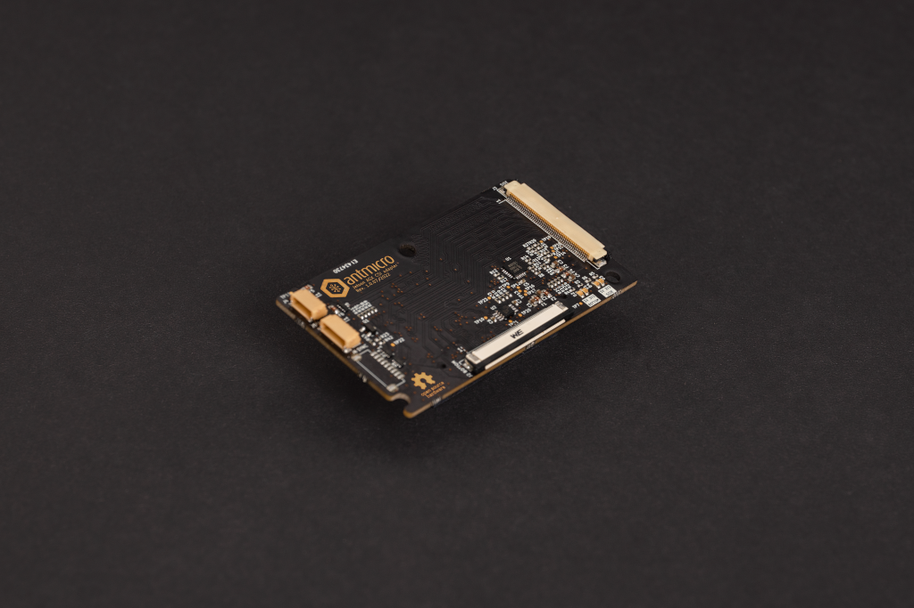

# Antmicro Jetson AGX CSI Adapter

Copyright (c) 2022-2023 [Antmicro](https://www.antmicro.com)

## Overview
This project contains hardware design files for a CSI camera adapter designed to be used with Nvidia Jetson AGX platform devkits (Orin, Xavier).
It separates the camera module interface connector into two 50-pin flat cable connectors, which are compatible with a variety of video accessories developed by Antmicro.
 
## Project structure
The main directory contains KiCad PCB project files, a LICENSE, and a README.
The remaining files are stored in the following directories:

* `img` - contains graphics for this README
* `doc` - contains generated schematics and other documentation
* `lib` - contains KiCad component library

## Key features
* Nvidia Camera Module Connector compatible with Jetson AGX Orin and Jetson Xavier AGX devkits,
* Two Antmicro CSI Connectors (2x 4-lane MIPI CSI-2 or 4x 4-lane MIPI CSI-2)
* I2C multiplexer for connecting multiple cameras to separate I2C interfaces
* On-board DC-DC converter to power the cameras
* Simple frame synchronization circuitry
* QWIIC connector for external sensors
* Liquid lens connector for I2C-controlled liquid lenses

The camera connectors are electrically compatible with several video accessories created by Antmicro, such as:
 
* [Antmicro - Alvium flexible CSI adapter](https://github.com/antmicro/alvium-flexible-csi-adapter)
* [OV9281 Dual Camera Board](https://github.com/antmicro/ov9281-camera-board)
* [SDI-MIPI bridge](https://github.com/antmicro/sdi-mipi-bridge)
* [HDMI-MIPI bridge](https://github.com/antmicro/hdmi-mipi-bridge)

## License
This project is published under the [Apache-2.0](LICENSE) license.
